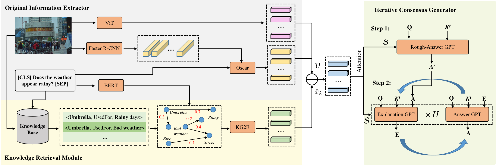

# [TIP Submission] KICNLE

This repository contains the official PyTorch implementation of paper "Knowledge-Augmented Visual Question Answering with Natural Language Explanation" for Transaction on Image Processing Submission.

## Overview

The KICNLE model enhances visual question answering by using an iterative method where each answer is refined based on the previous explanation. It includes a knowledge retrieval module to ensure relevant and accurate information. This results in high-quality, consistent answers and explanations closely tied to the visual content.



## Installation
* Install Anaconda or Miniconda distribution based on Python3.8
* Main packages: PyTorch = 1.12, transformers = 4.30

## Pre-trained Model

* CLIP ViT-based model

```shell
pip install git+https://github.com/openai/CLIP.git
```

* [Oscar-based model](https://huggingface.co/YunxinLi/ModCR_checkpoints/resolve/main/oscar-base-checkpoint-2000000.zip?download=true)

* [Extensive GPT-2 Tokenizer & Pre-trained GPT-2 model on COCO Caption](https://drive.google.com/drive/folders/1Bfc__0HRzYPyvRe0Ur_oSbhO8dSavT4e)

## Training & Evaluation

* For VQA-X dataset

```shell
python vqaX.py
```

* For A-OKVQA dataset

```shell
python a_okvqa.py
```

